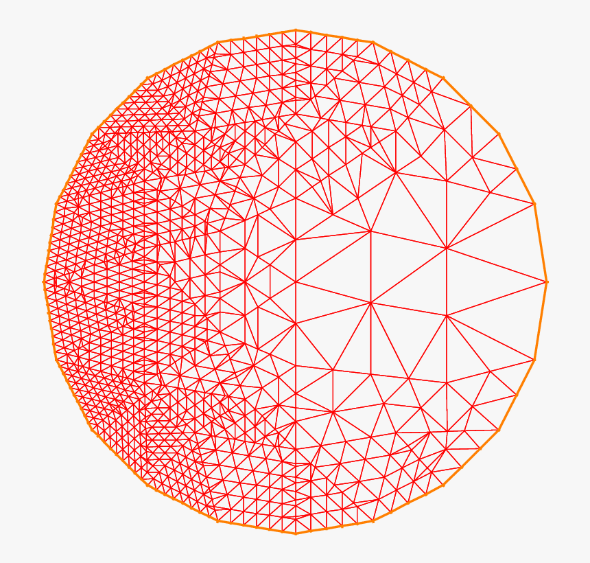

UGrid : Unstructured Grids
==========================

The UGrid class implements an unstructured grid object that can be used
as the underlying microstates for a physical system.  Unlike structured grids,
unstructured grids consist of a sample distribution of points which are
arranged arbitrarily.  One benefit of this approach is that the points can
be sampled according to a density so that areas where higher detail is present
can be populated more than areas where there is less detail.  These types of
grids have been used throughout the literature, See ...

The main attrubite of a UGrid object is an :code:`std::vector<std::vector<T>>`
called :code:`m_grid` that contains the sample points whose size is stored in
the :code:`m_N` and dimension in the :code:`m_dim` attributes respectively.
The main drawback of this approach to grids is the fact that each point must
be stored in memory, whereas a structured grid requires little information to
be stored.  It should be noted that the container :code:`m_grid` is not a
pointer and thus the management of the :code:`std::vector<std::vector<T>>`
object could lead to duplicate storage in memory.

Creating a UGrid object
+++++++++++++++++++++++

To create an unstructured grid object, simply call one of the available
constructors.  One can pass in an already created :code:`std::vector<std::vector<T>>`.

.. code-block:: c++

   std::vector<std::vector<double>> my_data;
   // ...
   // filling in my_data
   // ...
   UGrid<double> my_grid(my_data);  // This copies my_data to UGrid.

.. Note::

   The above call to the constructor :code:`UGrid<double> my_grid(my_data)` will
   copy the contents of my_data into :code:`my_grid.m_data` resulting in my_data
   existing in two places in memory.  It is possible instead to move the contents
   of :code:`my_data` into :code:`my_grid.m_data` in two different ways.

This is of course unpreferred since now :code:`my_data` will exist in two places
in memory.  If :code:`my_data` is not used by any other part of the code, one can
instead use the :code:`moveGrid(const std::vector<std::vector<T>> t_grid)` method.

.. code-block:: c++

   std::vector<std::vector<double>> my_data;
   // ...
   UGrid<double> my_grid();      // Create default UGrid object
   my_grid.moveGrid(my_data);    // Move the contents of my_data to my_grid.m_ugrid

In the above the :code:`moveGrid` function simply calls the :code:`std::move`
command on :code:`my_data`.  This functionality can also be used during
instantiation.  Going back to the first example, one can pass in the argument
:code:`bool move_grid = false` setting it to :code:`true`.

.. code-block:: c++

   std::vector<std::vector<double>> my_data;
   // ...
   UGrid<double> my_grid_copied(my_data);                // Contents of my_data copied to m_grid.

   UGrid<double> my_grid_moved(my_data, move_grid=true); // Contents of my_data moved to m_grid.

Python object creation
----------------------

The python bindings have a similar syntax for instantiating UGrids.  The
:code:`m_data` member can be initialized using a :code:`numpy` array.

.. code-block:: python

   import numpy as np
   from etraj import UGrid

   num_samples = 100
   x = np.random.uniform([0,0],[1,1],size=(num_samples,2))

   # in default, x will be copied to m_grid so that it remains alive
   # in python.
   ugrid = UGrid(x)

Access operators
++++++++++++++++

Access operators are overloaded for the UGrid class so that one can manipulated
individual points in :code:`m_grid`.  Simply call the object using parenthesis
to gain access.

.. code-block:: c++

   // ...
   // some creation of a UGrid<double> object
   // ...

   size_t index = 64;
   std::vector<double> point = my_grid(index);  // Copies the contents of m_grid(index)

   // ...
   // some manipulaiton of point
   // ...

   m_grid(index) = point;                       // Assigns m_grid(index) to point

Python access operators
-----------------------

Nearest neighbor searches
+++++++++++++++++++++++++

UGrids contain a KDTree instance as one of their members.  The individual KDTree
methods are overloaded in UGrid so that they can be called directly without having
to first access the private :code:`m_kdtree` member.

.. code-block:: c++

   // ...
   // some creation of a UGrid<double> object
   // ...

   size_t k = 10;
   my_grid.set_k(k);             // Set the number of NN's to k=10
   my_grid.queryNeighbors();     // Query m_kdtree for k=10 neighbors of each point in m_grid

   // grab the set of neighbor indices from the last search
   std::vector<std::vector<size_t>> neighbor_indices = m_grid.get_current_neighbor_indices();

UGrid Source Code
+++++++++++++++++

Below is the list of constructors and methods for the abstract Grid class.

.. doxygenclass:: ET::UGrid
   :project: etraj
   :members:
