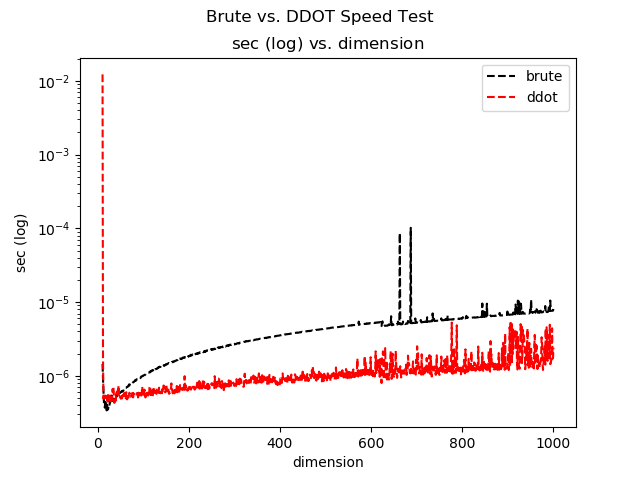

Vector
======

The ET framework implements a basic Vector class which wraps some Level one
`BLAS <http://www.netlib.org/blas/>`_ routines.  These include **DSWAP**, **DSCAL**,
**DCOPY**, **DAXPY**, **DDOT**, **DNRM2**, **DASUM**, **IDAMAX** and **IDAMIN**.
The basic functionality of these methods is discussed in the corresponding
subsection :ref:`BLAS Overview`.

A Vector object in the ET framework has a few basic properties, such as a
**name** a **dimension** and a corresponding **std::vector** containing the
coefficients.  There are some other useful attributes such as a std::string
**info** that can be set to contain pertinent information.  A corresponding
variable **flag** can be used to set the *type* of information stored in
**info**.  At runtime different methods will use **info** to pass information
back and forth.

.. _Constructors:

Constructors
------------

To create a Vector object, simply call one of the many available constructors,

.. code-block:: c++
   :linenos:

   #include "vector.h"

   int main()
   {
     //  Default constructor
     Vector<double> v;
     //  Constructor with dimension
     size_t dim = 10;
     Vector<double> v_dim(dim);

     //  Constructor with name and dimension
     std::string name = "v_name_dim";
     size_t dim = 3;
     Vector<double> v_name_dim(name,dim);

     //  Constructor with std::vector of coefficients
     std::vector<double> vec = {0.0,1.0,2.0};
     Vector<double> v_vec(vec);

     //  Constructor with name and std::vector of coefficients
     std::string name = "v_name_vec";
     std::vector<double> vec = {5.0,3.0,1.0,0.0};
     Vector<double> v_name_vec(name,vec);

     //  Constructor with dimension and initial value
     size_t dim = 8;
     const double init = 137;
     Vector<double> v_dim_init(dim,init);

     //  Constructor with name, dimension and initial value
     std::string name = "v_name_dim_init";
     size_t dim = 5;
     const double init = 1 / 137;
     Vector<double> v_name_nim_init(name,dim,init);

     return 0;
   }

The python version shares the same constructors,

.. code-block:: python
   :linenos:

   from etraj import Vector

   # Default constructor
   v = Vector()
   # Constructor with dimension
   dim = 10
   v_dim(dim)

   # Constructor with name and dimension
   name = "v_name_dim"
   dim = 3
   v_name_dim = Vector(name,dim)

   # Constructor with std::vector of coefficients
   vec = [0.0,1.0,2.0]
   v_vec = Vector(vec)

   # Constructor with name and std::vector of coefficients
   name = "v_name_vec"
   vec = [5.0,3.0,1.0,0.0]
   v_name_vec = Vector(name,vec)

   # Constructor with dimension and initial value
   dim = 8
   init = 137
   v_dim_init = Vector(dim,init)

   # Constructor with name, dimension and initial value
   name = "v_name_dim_init"
   dim = 5
   init = 1 / 137
   v_name_nim_init = Vector(name,dim,init)

.. _BLAS Overview:

Level One BLAS
--------------

As was mentioned in the beginning of this section, the Vector class implements
a set of Level one BLAS functions.  One that is used quite often is **DDOT**
which performs the dot product between two vectors in :math:`\mathbb{R}^d`.
There is also a dot product that is native to the Vector class called **dot**,
(there is also an overloaded operator for the scalar product using the asterisk)
which performs the dot product using brute force.  To see the differences in
performance one can run the following test from the tests folder,

.. code-block:: c++
   :linenos:

   //  speed_test_dot_product.cpp
   #include "vector.h"
   #include <random>
   #include <fstream>
   #include <iterator>
   #include <memory>
   #include <vector>
   #include <chrono>

   using namespace ET;

   void speedTestDotProduct()
   {
     //  The maximum number of elements to take the dot product of
     const int START = 100000;
     const int END = 10000000;
     const int INTERVAL = 10000;
     //  Arrays to hold the time differences
     std::vector<double> time_diff1;
     std::vector<double> time_diff2;
     std::vector<double> time_diff3;
     //  Setup vectors of coefficients
     std::vector<double> vec1;
     std::vector<double> vec2;
     //  Setup random number generator
     const int range_from  = 0.0;
     const int range_to    = 1.0;
     std::random_device rand_dev;
     std::mt19937 generator(rand_dev());
     std::uniform_real_distribution<double> distr(range_from, range_to);
     //  Setup clocks
     auto start = std::chrono::steady_clock::now();
     auto end = std::chrono::steady_clock::now();
     auto start2 = std::chrono::steady_clock::now();
     auto end2 = std::chrono::steady_clock::now();
     auto start3 = std::chrono::steady_clock::now();
     auto end3 = std::chrono::steady_clock::now();

     double duration = 0;
     double duration2 = 0;
     double duration3 = 0;
     double dot_brute = 0;
     double ddot = 0;
     double dot_cblas = 0;
     //  Iterate from 0 to NUM_ELEMENTS
     for(auto i = START; i < END; i+=INTERVAL) {
       //  Construct the two vectors using random elements
       vec1.resize(i);
       vec2.resize(i);
       for (auto j = 0; j < i; j++) {
         vec1[j] = distr(generator);
         vec2[j] = distr(generator);
       }
       Vector<double> v1(vec1);
       Vector<double> v2(vec2);
       //  Perform the brute force dot product
       // std::cout << "brute\n";
       //   Timer timer;
       start = std::chrono::steady_clock::now();
       dot_brute = v1.dot(v2);

       end = std::chrono::steady_clock::now();
       duration = std::chrono::duration_cast<std::chrono::nanoseconds>
                               (end-start).count();
       //  Store the result1
       time_diff1.push_back(duration);
       //  Perform the secont dot product
       start2 = std::chrono::steady_clock::now();
       // std::cout << "ddot\n;
       // Timer timer;
       ddot = DDOT(v1,v2);
       end2 = std::chrono::steady_clock::now();
       duration2 = std::chrono::duration_cast<std::chrono::nanoseconds>
                               (end2-start2).count();
       //  Store the result
       time_diff2.push_back(duration2);
       //  Try using cblas directly
       start3 = std::chrono::steady_clock::now();
       dot_cblas = cblas_ddot(i,//  dimension of the t_vectors
                         vec1.data(),  //  pointer to the elements of v
                         1,           //  increment of the elements of v
                         vec2.data(),  //  pointer to the elements of u
                         1);          //  increment of the elements of u

       end3 = std::chrono::steady_clock::now();
       duration3 = std::chrono::duration_cast<std::chrono::nanoseconds>
                               (end3-start3).count();
       //  Store the result1
       time_diff3.push_back(duration3);
     }
     //  Save the results to file
     {
       std::ofstream fout("speed_test_results_brute.txt");
       fout.precision(10);
       std::copy(time_diff1.begin(), time_diff1.end(),
                 std::ostream_iterator<double>(fout, "\n"));
     }
     {
       std::ofstream fout("speed_test_results_ddot.txt");
       fout.precision(10);
       std::copy(time_diff2.begin(), time_diff2.end(),
                 std::ostream_iterator<double>(fout, "\n"));
     }
     {
       std::ofstream fout("speed_test_results_cblas_direct.txt");
       fout.precision(10);
       std::copy(time_diff3.begin(), time_diff3.end(),
                 std::ostream_iterator<double>(fout, "\n"));
     }
   }

   int main()
   {
     speedTestDotProduct();
   }

The results of the test can be exposed with the following python script,

.. code-block:: python
   :linenos:

   import matplotlib.pyplot as plt
   import csv

   brute = []
   ddot = []
   cblas = []
   with open("speed_test_results_brute.txt", "r") as file:
       reader = csv.reader(file,delimiter=",")
       for row in reader:
           brute.append(float(row[0])*10e-9)
   with open("speed_test_results_ddot.txt", "r") as file:
       reader = csv.reader(file,delimiter=",")
       for row in reader:
           ddot.append(float(row[0])*10e-9)
   with open("speed_test_results_cblas_direct.txt", "r") as file:
       reader = csv.reader(file,delimiter=",")
       for row in reader:
           cblas.append(float(row[0])*10e-9)
   ns = [1000 + 100*i for i in range(1,len(ddot)+1)]

   fig, axs = plt.subplots()
   axs.plot(ns,brute,color='k',linestyle='--',label='brute')
   axs.plot(ns,ddot,color='r',linestyle='--',label='ddot')
   axs.plot(ns,cblas,color='b',linestyle='--',label='cblas')
   axs.set_yscale('log')
   axs.set_ylabel(r'$\log$(ns)')
   axs.set_xlabel('dimension')
   axs.set_title(r'$\log$(ns) vs. dimension')
   plt.suptitle('Brute vs. DDOT Speed Test')
   plt.legend()
   plt.show()

The results for different tests are shown below

Vector Source Code
------------------

.. doxygenclass:: ET::Vector
   :project: etraj
   :members:
